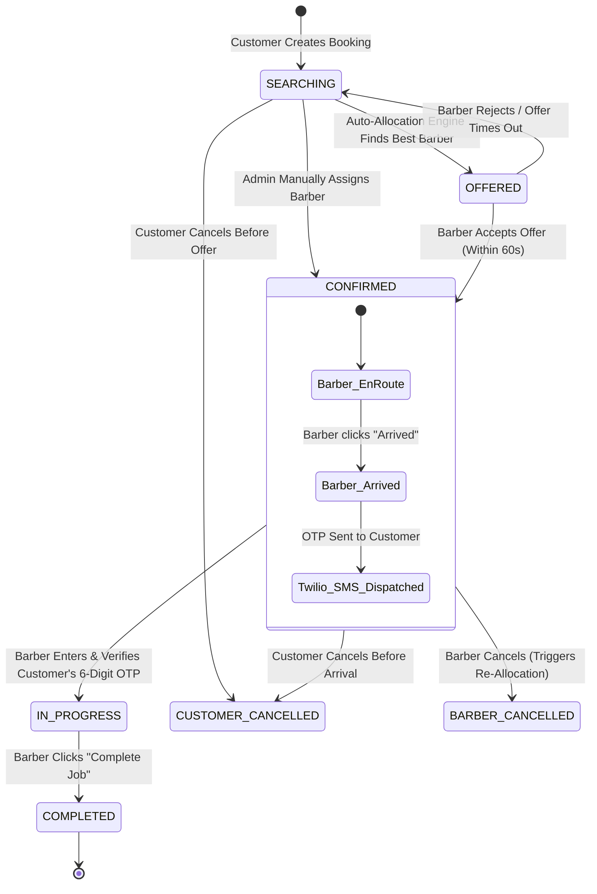

# 📖 AURA STUDIO — Complete User Flows & System Architecture Guide

Welcome to the **AURA STUDIO** (Salon & Mobile Barber Booking Platform) documentation. This guide details the complete end-to-end user journeys for **Customers**, **Barbers**, and **Administrators**, including the **Geospatial Auto-Allocation Engine**, **Twilio SMS Inform Flow**, **OTP-based Service Verification Lifecycle**, and **Real-Time Socket.IO Synchronizations**.

---

## 📑 Table of Contents
1. [System Credentials](#1-system-credentials)
2. [End-to-End State Machine Architecture](#2-end-to-end-state-machine-architecture)
3. [Customer Journey (Client Flow)](#3-customer-journey-client-flow)
4. [Barber Journey (Partner Flow)](#4-barber-journey-partner-flow)
5. [Administrator Journey (Platform Operations)](#5-administrator-journey-platform-operations)
6. [Twilio SMS Inform & OTP Verification Lifecycle](#6-twilio-sms-inform--otp-verification-lifecycle)
7. [Real-Time Socket.IO Event Reference](#7-real-time-socketio-event-reference)
8. [Complete API Routes Index](#8-complete-api-routes-index)

---

## 1. System Credentials

For local development and testing, use the pre-configured credentials:

| Role | Email | Password | Access / Permissions |
| :--- | :--- | :--- | :--- |
| **Admin** | `admin@salonbooking.com` | `Admin@123` | Full platform dashboard, manual barber assignment, partner approvals, audit logs |
| **Barber** | `amit.kumar@salonbooking.com` | `Barber@123` | Partner dashboard, job dispatch alerts, arrive & OTP verification, job completion |
| **Customer** | `priya@example.com` | `Customer@123` | Booking catalog, geospatial radar, OTP viewing & SMS resend, reviews/ratings |

---

## 2. End-to-End State Machine Architecture

The booking and barber assignment lifecycle follows a deterministic, state-machine validated workflow:



---

## 3. Customer Journey (Client Flow)

```
[Browse Catalog & Prices in ₹] ➔ [Select Barber / Any] ➔ [Confirm Booking] ➔ [Receive Twilio SMS with OTP] ➔ [Provide OTP to Barber] ➔ [Enjoy Grooming] ➔ [Submit Review & Rating]
```

### Step 1: Account Registration & Authentication
- **Register/Login**: Customer creates an account with Name, Email, Mobile Number (`+91...`), and Password.
- **Secure Sessions**: Authenticates via JWT tokens (Access Token stored in localStorage / memory, Refresh Token for auto-renewal).

### Step 2: Browsing Catalog & Radar
- **Services Catalog**: View curated grooming services with prices in Indian Rupees (`₹499`, `₹299`, `₹899`, `₹799`) and durations (`40m`, `30m`, `65m`, `60m`).
- **Nearby Barbers Radar**: Interactive geospatial radar detects verified mobile barbers within a configurable radius (e.g. 5–15 km) with star ratings and distance calculations.

### Step 3: Creating a Booking
- Customer selects service and sets appointment date & time.
- **Barber Preference Modes**:
  - `ANY`: System automatically allocates the highest-ranked nearby barber based on distance, rating, availability, acceptance rate, and completion rate.
  - `SPECIFIC`: Customer selects their favorite barber directly.

### Step 4: Live Booking Card & Real-Time Tracking
- Once booked, the customer sees a live status card with their booking number (e.g. `#BK-MSZQE0CP-TEW`).
- Real-time Socket.IO events instantly update the UI when a barber is matched (`booking:confirmed`).

### Step 5: Twilio SMS & OTP Verification
- **Barber Arrival**: When the barber reaches the customer's home, an SMS is sent to the customer's mobile number via **Twilio**:
  > `"[AURA STUDIO] Hello Priya, your barber Amit Kumar has arrived for your booking #BK-MSZQE0CP-TEW (Executive Haircut). Your Service Verification OTP is: 506175. Please provide this OTP to your barber to start the service. Valid for 30 mins."`
- **Customer Screen**: Displays the 6-digit OTP with an active 30-minute countdown timer, a **"Copy OTP"** button, and a **"Resend SMS"** button for SMS redelivery.
- **Service Kickoff**: Customer shares the OTP with the barber.

### Step 6: Completion & Feedback
- Once the service finishes, the customer is invited to rate their experience (1–5 Stars) and leave written feedback (`POST /api/v1/reviews`), which automatically recalculates the barber's live average rating.

---

## 4. Barber Journey (Partner Flow)

```
[Login to Partner Portal] ➔ [Turn ON Auto-Allocation] ➔ [Receive Instant Booking Offer] ➔ [Accept Assignment] ➔ [Click "Arrived"] ➔ [Enter Customer OTP] ➔ [Complete Job]
```

### Step 1: Barber Partner Portal
- Barber logs into the dedicated **Partner Dashboard**.
- Displays partner profile, total completed jobs (e.g., 150 jobs), live rating (`4.9★`), and verified partner badges.

### Step 2: Live Location & Auto-Allocation Dispatch
- **Auto-Allocation Toggle**: Barber toggles instant request dispatch (`ON` / `OFF`).
- **GPS Broadcasting**: Barber broadcasts their location (`PATCH /api/v1/barbers/me/location`) so the geospatial engine calculates exact arrival distances.

### Step 3: Receiving & Accepting Booking Offers
- When an auto-allocated booking occurs nearby, a real-time modal popup alert notifies the barber with service name, scheduled time, customer location, and a 60-second acceptance countdown timer.
- Barber taps **"Accept Booking"** (`POST /api/v1/assignments/:id/accept`).

### Step 4: Barber Arrival at Customer's Location
- Upon arriving at the customer's doorstep, the barber taps **"1. Arrived at Customer"** (`POST /api/v1/assignments/:id/arrive`).
- **Automated Actions**:
  1. The backend marks assignment as `ARRIVED`.
  2. Generates a secure 6-digit OTP (SHA-256 hashed).
  3. Dispatches the Twilio SMS directly to the customer's registered phone.
  4. Automatically opens the 6-digit OTP input modal on the barber's screen.

### Step 5: OTP Input & Verification
- Barber asks customer for their OTP and enters the 6 digits.
- Submits verification (`POST /api/v1/bookings/:id/verify-otp`).
- **Security**: Protected with constant-time comparison and brute-force attempt throttling (max 5 attempts).
- **On Success**: Booking transitions to `IN_PROGRESS`, service starts, and Twilio confirmation SMS is dispatched.

### Step 6: Completing the Service
- After delivering the grooming service, the barber clicks **"3. Complete Job"** (`POST /api/v1/assignments/:id/complete`).
- Transitions booking to `COMPLETED` and updates the barber's total completed jobs counter.

---

## 5. Administrator Journey (Platform Operations)

```
[Login as Root Admin] ➔ [Monitor Dispatch Engine] ➔ [View Platform Revenue in ₹] ➔ [Manual Barber Assignments] ➔ [Partner Approvals] ➔ [Audit Log Inspections]
```

### Step 1: Administration Portal
- Accessible via the **Admin Portal** tab for authorized administrators (`role: 'ADMIN'`).
- Displays real-time metrics:
  - Total Platform Revenue in Indian Rupees (`₹1,48,900`).
  - Active Verified Barbers fleet counter.
  - Total Completed Platform Bookings.
  - Geospatial Dispatch Engine health status.

### Step 2: Manual Booking Allocation & Override
- For phone-in bookings or failed auto-allocations, the admin can manually select any active barber from the directory and assign them (`POST /api/v1/admin/bookings/:id/assign`).
- Instantly creates the assignment, confirms the booking, generates the OTP, and dispatches the Twilio SMS to the customer.

### Step 3: Barber Fleet Management
- View registered barbers, their service radiuses, active skills, ratings, and account statuses (`ACTIVE`, `INACTIVE`, `SUSPENDED`).
- Admins can activate or suspend barbers with one click (`PATCH /api/v1/admin/barbers/:id/status`).

### Step 4: Telemetry & Immutable Audit Trail
- **Allocation Failures**: View telemetry on any unfulfilled booking requests (`GET /api/v1/admin/allocation-failures`).
- **Audit Logs**: Inspect complete immutable audit records (`GET /api/v1/admin/audit-logs`) documenting every actor, role, action, target entity, timestamp, and metadata.

---

## 6. Twilio SMS Inform & OTP Verification Lifecycle

### Outbound SMS Templates

#### 1. Barber Arrival & OTP Dispatch SMS
```
[AURA STUDIO] Hello {CustomerName}, your barber {BarberName} has arrived for your booking #{BookingNumber} ({ServiceName}). Your Service Verification OTP is: {OTP}. Please provide this OTP to your barber to start the service. Valid for 30 mins.
```

#### 2. Service Started Confirmation SMS
```
[AURA STUDIO] Hi {CustomerName}, OTP verified! Your {ServiceName} service with {BarberName} for booking #{BookingNumber} is now IN PROGRESS. Enjoy your session!
```

---

## 7. Real-Time Socket.IO Event Reference

| Event Name | Recipient | Payload | Trigger |
| :--- | :--- | :--- | :--- |
| `booking:searching` | Customer | `{ bookingId, message }` | Booking created and finding nearby barber |
| `assignment:new` | Barber | `{ assignmentId, booking }` | Barber receives an allocation offer |
| `booking:confirmed` | Customer | `{ bookingId, barberId }` | Barber accepted or admin assigned |
| `otp:generated` | Customer | `{ bookingId, otp, expiresAt }` | OTP created upon confirmation / arrival / resend |
| `otp:verified` | Barber | `{ bookingId }` | Successful OTP verification |
| `service:started` | Customer | `{ bookingId, barberId }` | Booking transitioned to `IN_PROGRESS` |
| `booking:completed` | Customer & Barber | `{ bookingId }` | Booking transitioned to `COMPLETED` |
| `booking:cancelled` | Customer & Barber | `{ bookingId, status }` | Booking cancelled by customer or admin |

---

## 8. Complete API Routes Index

### 🔐 Auth (`/api/v1/auth`)
- `POST /auth/register` — Register a customer or barber with mandatory validated phone.
- `POST /auth/login` — Login and receive JWT access + refresh tokens.
- `POST /auth/refresh` — Issue a new access token using a refresh token.
- `POST /auth/forgot-password` — Request 6-digit password reset OTP via Twilio SMS & Email (15m expiry).
- `POST /auth/verify-reset-otp` — Verify 6-digit password reset OTP & obtain reset grant token.
- `POST /auth/reset-password` — Reset account password using verified reset grant token.
- `GET /auth/me` — Retrieve the currently authenticated user profile.
- `POST /auth/logout` — Invalidate refresh token and end session.

### 💇 Services Catalog (`/api/v1/services`)
- `GET /services` — List all active grooming services with pricing in `₹`.
- `GET /services/:serviceId` — Get single service item by ID.

### 💈 Barbers (`/api/v1/barbers`)
- `GET /barbers/nearby?latitude=...&longitude=...&radiusKm=...` — Geospatial radar search.
- `GET /barbers/me` — Get authenticated barber's profile and stats.
- `PATCH /barbers/me/location` — Broadcast barber's GPS coordinates.
- `PATCH /barbers/me/auto-allocation` — Toggle auto-dispatch acceptance.
- `GET /barbers/me/services` — Get barber's enabled services list.
- `GET /barbers/:barberId` — Get public barber profile.

### 📅 Bookings & OTP (`/api/v1/bookings`)
- `POST /bookings` — Create a new booking (`ANY` or `SPECIFIC` preference).
- `GET /bookings` — List authenticated customer's bookings.
- `GET /bookings/:bookingId` — Get single booking details & assignment history.
- `GET /bookings/:bookingId/otp` — Customer retrieves their 6-digit service OTP.
- `POST /bookings/:bookingId/resend-otp` — Customer requests Twilio SMS OTP resend.
- `POST /bookings/:bookingId/verify-otp` — Barber submits customer OTP to start service.
- `POST /bookings/:bookingId/cancel` — Customer cancels booking before service starts.

### 🚗 Assignments (`/api/v1/assignments`)
- `POST /assignments/:assignmentId/accept` — Barber accepts an allocation offer.
- `POST /assignments/:assignmentId/reject` — Barber rejects an allocation offer.
- `POST /assignments/:assignmentId/arrive` — Barber marks arrival & triggers Twilio SMS.
- `POST /assignments/:assignmentId/start` — Barber starts service (fallback route).
- `POST /assignments/:assignmentId/complete` — Barber completes the job.
- `POST /assignments/:assignmentId/cancel` — Barber cancels an accepted assignment.

### ⭐ Reviews & Ratings (`/api/v1/reviews`)
- `POST /reviews` — Customer submits a 1–5 star review for a completed booking.
- `GET /reviews/barber/:barberId` — Get public verified customer reviews for a barber.

### 👑 Admin Operations (`/api/v1/admin`)
- `GET /admin/bookings` — Platform-wide bookings analytics & table.
- `GET /admin/barbers` — Directory of all registered barber partners.
- `POST /admin/bookings/:bookingId/assign` — Manually assign a barber & confirm booking.
- `PATCH /admin/barbers/:barberId/status` — Update barber partner status (`ACTIVE`/`SUSPENDED`).
- `GET /admin/allocation-failures` — Telemetry on unmatched booking requests.
- `GET /admin/audit-logs` — Immutable system audit trail.
